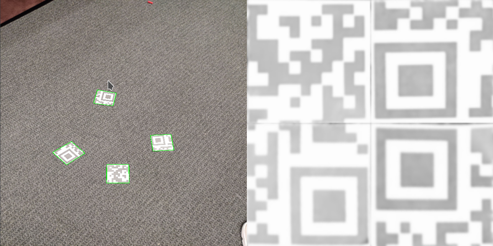

# Software Vision Challenge

Welcome to the 2023 Penn Aerial Robotics software challenge! The goal of this challenge is not only for the board to best assess your fit for the software team, but also for you to get a taste for the types of projects that you will be asked to tackle as a member of the team.

Take however long you want to work on the challenge. If you can’t complete the full challenge, don’t worry—it’s meant to be difficult. Remember we are looking for commitment and willingness to learn, not previous knowledge, so don’t get discouraged if you’re having trouble. We’ve provided resources below to help you and are looking for you to give this your best effort. **Submit however much you can complete.** Be prepared to talk about your code and to explain how you arrived at your solution.

# Submission

Please **submit a zip file** containing your code on the google form with your application by **11:59 p.m. Wednesday, September 14th**:

Please include your full name in the title of your zip file.

Please also include a README file in your submission with the following:

1. How far did you get with the challenge? How much time did it take?
2. Please provide a brief description of the way that you have organized your code.
3. Please **provide instructions on how to run your code**.
4. Is there any other relevant information that would be helpful for us to know?

# Support

If you have clarification questions or are in need of any assistance, don’t hesitate to reach out! Especially if you have trouble during figuring out how to use GitHub. We want to challenge you with the coding challenge, not with the setup. Feel free to email [jsq@seas.upenn.edu](mailto:jsq@seas.upenn.edu) or [daveshv@seas.upenn.edu](mailto:daveshv@seas.upenn.edu).

# Resources

Feel free to use whatever outside resources you wish. In fact, we highly recommend that you do research into the subject of how QR codes work. A large part of being on this team is learning how to do research and figure things out. You can use whatever guides you find online, whatever libraries you want, and **any programming language**. However, you must fully understand how your code works because you will be asked to explain it. Commenting your code is also good practice and can help us (and you) understand what you’re doing. You might find the following websites useful:

[http://dsynflo.blogspot.com/2014/10/opencv-qr-code-detection-and-extraction.html](http://dsynflo.blogspot.com/2014/10/opencv-qr-code-detection-and-extraction.html)

[https://www.learnopencv.com/opencv-qr-code-scanner-c-and-python/](https://www.learnopencv.com/opencv-qr-code-scanner-c-and-python/)

[http://aishack.in/tutorials/scanning-qr-codes-1/](http://aishack.in/tutorials/scanning-qr-codes-1/)

[https://en.wikipedia.org/wiki/QR_code](https://en.wikipedia.org/wiki/QR_code)

You should also feel free to reach out to [jsq@seas.upenn.edu](mailto:jsq@seas.upenn.edu) or [daveshv@seas.upenn.edu](mailto:daveshv@seas.upenn.edu) if you are stuck and need some assistance.

# The Challenge

Previously, at the IARC 2020 competition, one of our challenges was to identify and isolate multiple QR code snippets from a live camera feed and stitch them together to read a number. In the folder below there are four images, each containing ¼  of a QR code - with some overlap between the pieces. Your goal will be to “recover” the QR code data. **The QR code is Version 1 with correction level “H”.**

**Please find the provided images for this task under the “data” folder.**

The challenge is split into three parts, but **the first part is optional. You should attempt to complete parts two and three first, and only attempt part one if you want an extra challenge.**

Figure 1 - visualization of a solution to parts 1 and 2. Your solution may be different.

## Part 1: Detection - **OPTIONAL**

Your first task is to detect the QR piece in each of the images. There are several ways of doing this. If you don’t know where to start, take a look at the resources above. Some useful tools here are: thresholding, blurring, contour detection, canny filters and harris corner detection. Read about those tools and think about how you could use them to detect a QR code. Think about how the QR code is different from the other objects in the image and use that knowledge to detect it.

**Since this section is optional,** we have provided cropped versions of the 4 QR code images in addition to the raw photos. These cropped photos represent an approximate solution to part 1. The images have not been rotated or changed in any other way, they are simply crops. Note that the amount of “extra” that is present in the cropped versions is not necessarily uniform across all photos, a typical result when detecting objects algorithmically. You are free to manually or programmatically clean up the images further if you would like. 

## Part 2: Transform

Now that you know where the QR code pieces are in the image, you need to extract it from the image. To decode the QR code, you will need to deskew it - for example, using a **perspective transform**. OpenCV’s [getPerspectiveTransform](https://www.pyimagesearch.com/2014/08/25/4-point-opencv-getperspective-transform-example/) function might be useful. Your output image should be aligned such that the QR code grid is aligned with the horizontal/vertical and all lines are perpendicular. See figure 1 for an example.

## Part 3: Decode

We will leave this part open ended. Your goal is to decode the information contained in the images generated in part 2.

**UPDATE: We know some people have had trouble decoding their QR codes. If you cannot solve this, try to output an image which is good enough that you are able to read the QR code with your phone.**

Hint: The QR code encodes a 4 digit number. You might not need to read the whole QR code to find that number.
